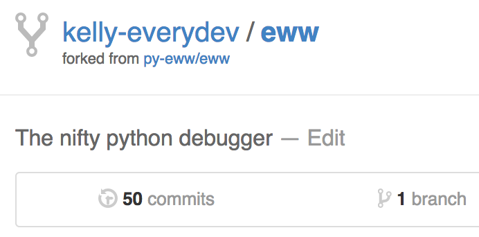
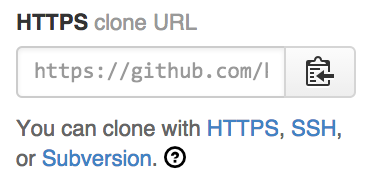
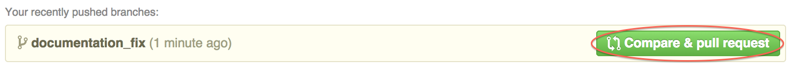
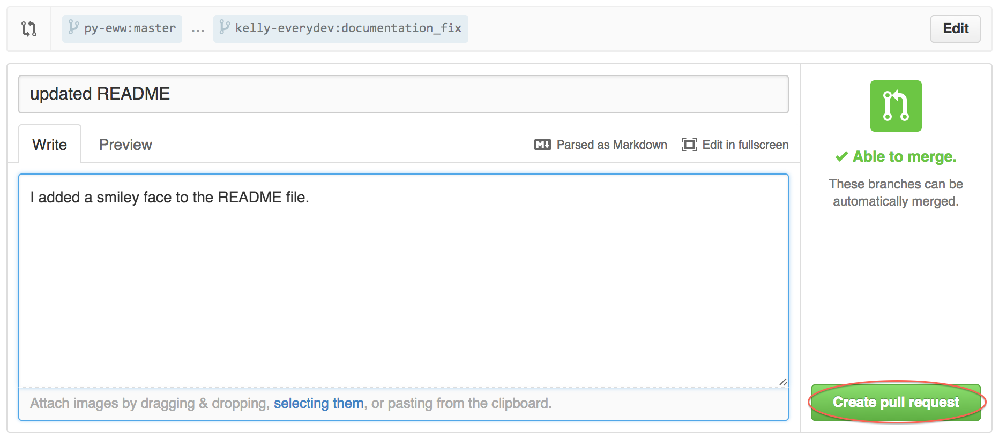
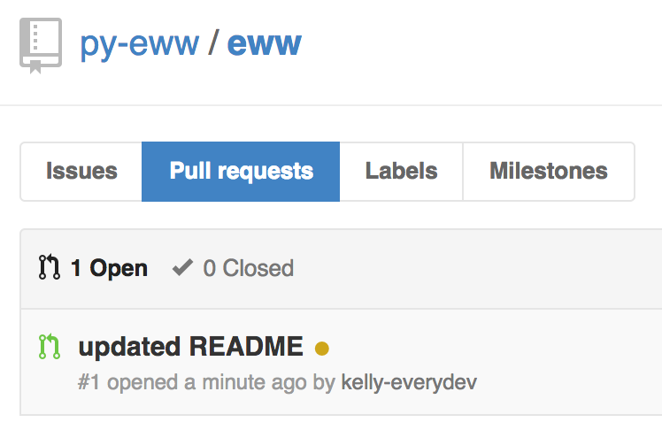

.. _contributing:

Contributing
============

We hugely appreciate every contribution, no matter the size.  You don't have to worry about snippy responses, or your pull request being ignored.  We want you involved in Eww.

For Experienced Contributors
----------------------------

Eww's source is on `Github <https://github.com/py-eww/eww>`_.

After forking, make your changes in a new branch off of master.  When you're ready to send the PR, send it against Eww's master branch.

Tests can be ran like so::

    make test  # To run all tests with the current interpreter
    make tox    # To run all tests on all supported interpreters

Tests are not *required*, but definitely encouraged.

Make sure to add yourself to the contributor's file.

That's about it, pretty straightforward.

First Time Contributors
-----------------------

If you've thought about contributing to open source before but haven't felt comfortable doing so, Eww is a great first project for you.

We're going to walk through the process, in detail, for making a small change to Eww's documentation.  The same process is used for any change.

First, you'll need a `Github <http://github.com>`_ account.

Once you're logged in, head over to the `Eww <https://github.com/py-eww/eww>`_ repository.

On the top right side of the page, hit the 'Fork' button to get your own copy of the Eww repository.

After hitting the fork button and waiting a moment, you'll be redirected to your personal copy of the Eww repository:

There will be a link on the right hand side that you can use in conjuction with ``git clone`` to get the repository on your local computer:

You'll want to clone the repository, and then create a new branch for your work.  We'll call the branch ``documentation_fix``::

    basecamp ~/contributing: git clone https://github.com/kelly-everydev/eww.git
    Cloning into 'eww'...
    remote: Counting objects: 369, done.
    remote: Compressing objects: 100% (127/127), done.
    remote: Total 369 (delta 178), reused 369 (delta 178)
    Receiving objects: 100% (369/369), 139.62 KiB | 71.00 KiB/s, done.
    Resolving deltas: 100% (178/178), done.
    Checking connectivity... done.
    basecamp ~/contributing/eww: git checkout -b documentation_fix
    Switched to a new branch 'documentation_fix'
    basecamp ~/contributing/eww:

Next, create a new virtual environment for working on Eww, and install Eww's development dependencies::

    basecamp ~/contributing/eww: mkvirtualenv eww
    New python executable in eww/bin/python
    Installing setuptools, pip...done.
    (eww)basecamp ~/contributing/eww: pip install -r requirements.txt
    <snip>

Now you can go ahead and make your changes.

To make sure your changes haven't broken something accidentally, we have a collection of tests you can run to confirm things are working properly.

You can run the tests like so::

    (eww)basecamp ~/contributing/eww: make test  # To run all tests with the current interpreter
    (eww)basecamp ~/contributing/eww: make tox    # To run all tests on all supported interpreters

When your changes are complete, you'll want to commit them with a descriptive commit message, and push them to Github::

    (eww)basecamp ~/contributing/eww: git status
    On branch documentation_fix
    Changes not staged for commit:
      (use "git add <file>..." to update what will be committed)
      (use "git checkout -- <file>..." to discard changes in working directory)

        modified:   README.rst

    no changes added to commit (use "git add" and/or "git commit -a")
    (eww)basecamp ~/contributing/eww: git add .
    (eww)basecamp ~/contributing/eww: git status
    On branch documentation_fix
    Changes to be committed:
      (use "git reset HEAD <file>..." to unstage)

        modified:   README.rst

    (eww)basecamp ~/contributing/eww: git commit -m "updated README"
    [documentation_fix 1af9a21] updated README
     1 file changed, 1 insertion(+), 1 deletion(-)
    (eww)basecamp ~/contributing/eww: git push origin documentation_fix
    Username for 'https://github.com': kelly-everydev
    Password for 'https://kelly-everydev@github.com':
    Counting objects: 3, done.
    Delta compression using up to 4 threads.
    Compressing objects: 100% (3/3), done.
    Writing objects: 100% (3/3), 297 bytes | 0 bytes/s, done.
    Total 3 (delta 2), reused 0 (delta 0)
    To https://github.com/kelly-everydev/eww.git
     * [new branch]      documentation_fix -> documentation_fix
    (eww)basecamp ~/contributing/eww:

Once your changes are on Github, you can open up the pull request.  Take a look at your personal repo again and you should see a new button for creating a pull request.

Pressing the pull request button brings you to the pull request creation screen.  You'll want to fill it out a bit like this, and then click 'Create pull request'.

If you head back to the main Eww repository, you'll see your pull request listed:

If everything looks ok, then the Eww maintainer will accept your pull request and release a new version of Eww with your changes.

It's possible we'll have questions about your change.  If we do, we'll add a comment to your pull request and work with you to figure things out.

That's it! You've made your first open source contribution.