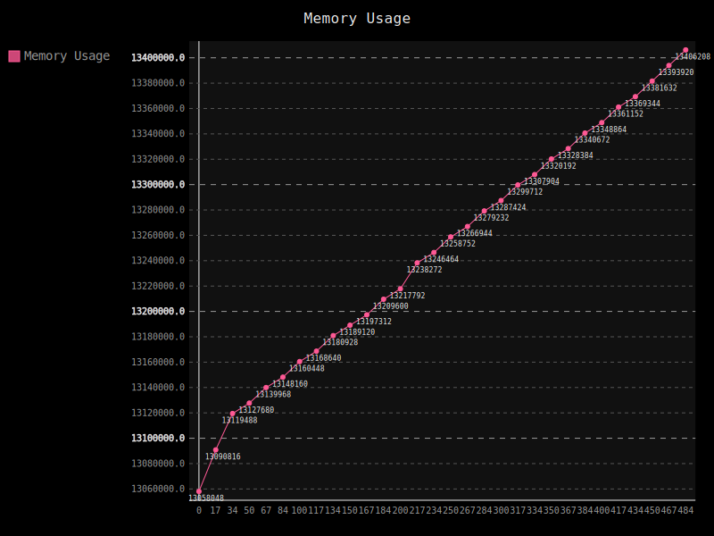
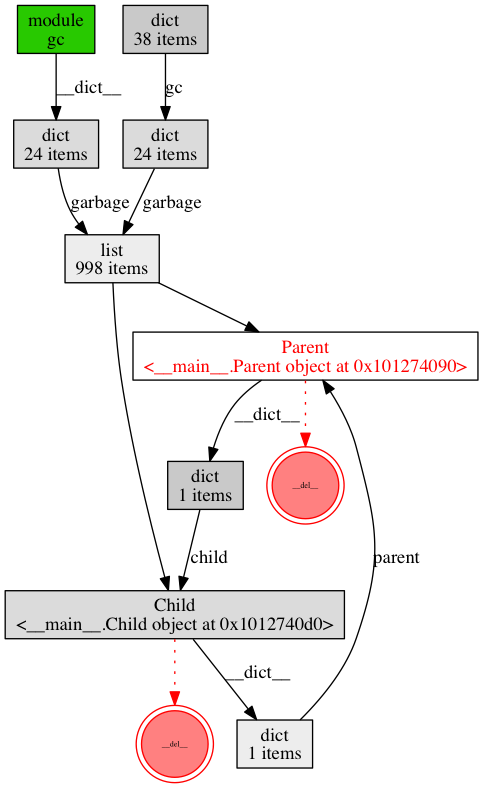
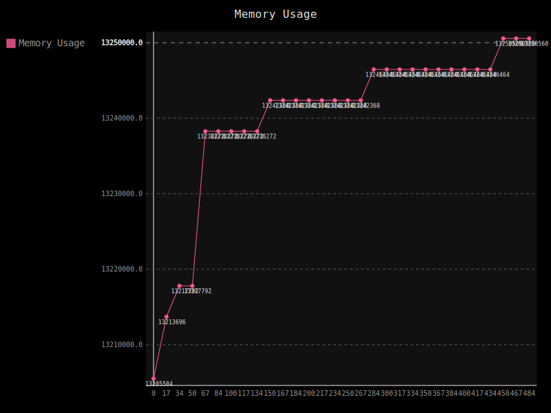

.. _debugging_a_memory_leak:

Debugging a Memory Leak
=======================

To see the kind of power Eww gives you, we're going to use it to diagnose a memory leak.

This script here leaks memory quite badly::

    #! /usr/bin/env python

    class Parent(object):

        def __init__(self):
            self.child = None

        def __del__(self):
            pass

    class Child(object):

        def __init__(self):
            self.parent = None

        def __del__(self):
            pass

    if __name__ == '__main__':

        for num in range(500):
            parent = Parent()
            child = Child()

            parent.child = child
            child.parent = parent

If only all reference cycles were this simple.

.. note::
    **Why does this leak?**

    Python uses a `reference counting <http://en.wikipedia.org/wiki/Reference_counting>`_ scheme for reaping old objects.  Python keeps track of the number of names attached to objects, and if that number drops to 0, Python will reap that object.

    Python can also handle *most* reference cycles.  The :py:mod:`gc` (garbage collection) module will take care of that for us.

    What the gc can't do is fix reference cycles where **both** objects have a ``__del__`` method.  The gc cannot automatically determine a safe order to run them in, so it refuses to reap either object.

    *This assumes you are using the CPython implementation.  The Python specification does not mention anything about object management, and individual implementations (PyPy, Jython, IronPython) may use different garbage collection techniques.*

Let's, for the exercise, say you've been running this in production for a while and notice that memory usage is constantly growing.

We'll add Eww to the script and see what we can find out.

Add :code:`import eww` to the script::

    #! /usr/bin/env python

    import eww

Then we'll make two small changes to the code creating the objects::

    if __name__ == '__main__':

        eww.embed()  # 1

        for num in range(500):
            parent = Parent()
            child = Child()

            parent.child = child
            child.parent = parent

        import time; time.sleep(600)  # 2

We added a call to :code:`eww.embed()`, which sets up everything for Eww.  We also added a sleep at the end so the script doesn't immediately exit and we can look at what's going on.  Go ahead and run the script.

Now, we'll fire up the Eww client.  In another terminal window, run :code:`eww`.  You should see something like this::

    basecamp ~: eww
    Welcome to the Eww console. Type 'help' at any point for a list of available commands.
    Running in PID: 4899 Name: ./leak_demo.py
    (eww)

The Eww client connects to the Eww console running inside your application.  We can now do just about anything we want, while we're *inside* the running app.

Let's get a REPL::

    (eww) repl
    Dropping to REPL...
    Python 2.7.5 (default, Mar  9 2014, 22:15:05)
    [GCC 4.2.1 Compatible Apple LLVM 5.0 (clang-500.0.68)] on darwin
    Note: This interpreter is running *inside* of your application.  Be careful.
    >>>

Since we're in the same process as the leaky script, we can check for uncollectable cycles very easily::

    >>> import gc
    >>> gc.collect()
    0
    >>> len(gc.garbage)
    998
    >>>

998 uncollectable objects.  Ouch.

Before we dig any deeper, we ought to get some statistics around memory consumption so we can verify the bug and our fix.

To do that, we'll use Eww's statistics and graphing tools.  Let's add a datapoint at the start of each iteration in the for loop::

    for num in range(500):
        eww.graph('Memory Usage', (num, eww.memory_consumption()))
        parent = Parent()

Restart the leaky script, and connect with the Eww client again.  This time, instead of going straight to the REPL, let's check out our new stat::

    (eww) stats
    Graphs:
      Memory Usage:500
    (eww)

Cool, we've got 500 datapoints for the 'Memory Usage' statistic.  We can get the raw datapoints by running :code:`stats 'Memory Usage'`, but that's not very helpful.  Let's generate a graph instead::

    (eww) stats -g 'Memory Usage'
    Chart written to Memory Usage.svg
    (eww)

Which gives us something like this:

   *This is a fancy SVG, depending on your browser it may appear jumbled due to the theme used.  When displayed on it's own, it's far clearer.  Trends are easy to determine either way.*

Yep, that's a memory leak.

To identify exactly what's causing the leak, we're going to use `Objgraph <http://mg.pov.lt/objgraph/>`_.  A simple :code:`pip install objgraph` will install it for you.  You'll also need to have `graphviz <http://www.graphviz.org/>`_ installed for the nice graphs.

.. note::
    Objgraph includes a method called :code:`show_most_common_types()` that can be used to find leaking objects.  We are inspecting the :code:`gc.garbage` list instead, but it's good to be familiar with :code:`show_most_common_types()`.

Time to dig into one of the uncollectable objects in :code:`gc.garbage` and see if we can find the issue.  Let's head into the REPL again and use objgraph to show us some more detail::

    (eww) repl
    Dropping to REPL...
    Python 2.7.5 (default, Mar  9 2014, 22:15:05)
    [GCC 4.2.1 Compatible Apple LLVM 5.0 (clang-500.0.68)] on darwin
    Note: This interpreter is running *inside* of your application.  Be careful.
    >>> import gc
    >>> gc.collect()
    0
    >>> import objgraph
    >>> objgraph.show_backrefs(gc.garbage[0], max_depth=10)
    Graph written to /var/folders/gv/1xcz06bj2c5gfkl632fbjfr40000gn/T/objgraph-_qnjjD.dot (9 nodes)
    Graph viewer (xdot) not found, generating a png instead
    Image generated as /var/folders/gv/1xcz06bj2c5gfkl632fbjfr40000gn/T/objgraph-_qnjjD.png
    >>>

The generated graph makes the problem crystal clear:

There are a few ways to fix this.

* We can use the :py:mod:`weakref` module to make Child's reference to Parent a weak reference.
* We can explicitly break the reference.
* We can change the scripts design to not require cyclic references like this.

Let's go with Option #2 for simplicity here.  Update the for loop to have a del at the end of each iteration::

    for num in range(500):
        eww.graph('Memory Usage', (num, eww.memory_consumption()))
        parent = Parent()
        child = Child()

        parent.child = child
        child.parent = parent

        del child.parent

It's easy to tell if this worked.  We'll connect with Eww, check if there are any uncollectable objects, and graph memory usage again::

    (eww) repl
    Dropping to REPL...
    Python 2.7.5 (default, Mar  9 2014, 22:15:05)
    [GCC 4.2.1 Compatible Apple LLVM 5.0 (clang-500.0.68)] on darwin
    Note: This interpreter is running *inside* of your application.  Be careful.
    >>> import gc
    >>> gc.collect()
    0
    >>> len(gc.garbage)
    0
    >>> # Good!
    >>> exit
    Exiting REPL...
    (eww) stats -g 'Memory Usage' -f 'memory_usage_after_fix'
    Chart written to memory_usage_after_fix.svg
    (eww)

When we look at the new graph, we don't see a perfectly flat line like we'd expect.  This has to do with how Pymalloc works (and some memory consumption by Eww).  What's important is to compare the scale of this graph to the scale of the previous graph.

   *This is a fancy SVG, depending on your browser it may appear jumbled due to the theme used.  When displayed on it's own, it's far clearer.  Trends are easy to determine either way.*

That's about it for the basic tour.  Read on for more advanced features, and information on how Eww works.
